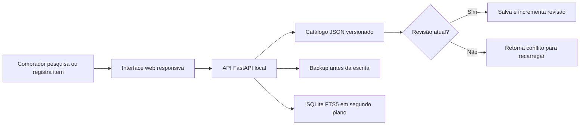

# ProcureFlow — do controle em planilha para um catálogo de compras compartilhado


**ProcureFlow** é uma demonstração sanitizada de um sistema que desenhei e implementei para substituir o controle de compras feito em planilhas compartilhadas. O objetivo não é substituir um ERP inteiro: é tornar a busca de materiais, o registro de preços, a consulta de fornecedores e o trabalho simultâneo mais confiáveis para quem compra no dia a dia.

> Esta versão foi preparada para portfólio: todos os dados, fornecedores, valores, históricos, caminhos e imagens são fictícios ou demonstrativos. Nenhum dado operacional da empresa está neste repositório.

## O problema

Uma planilha centraliza informação, mas começa a falhar quando mais pessoas precisam consultar ou atualizar preços: é difícil encontrar a descrição correta, não há prevenção de sobrescrita, o histórico fica disperso e o catálogo cresce sem padrão.

## O que construí

- Busca por nome, código, fornecedor, medida e sinônimos técnicos.
- Cadastro guiado que separa descrição, especificações, marca, código e unidade.
- Histórico de compras e último preço conhecido por item.
- Detecção de conflito por revisão: uma alteração antiga não sobrescreve a edição de outro computador.
- Backup automático antes de operações sensíveis e restauração controlada.
- Índice SQLite com FTS5 reconstruído em segundo plano, sem travar o salvamento principal.
- Importação/exportação de planilhas, leitura de código por câmera e OCR opcional.
- Auditoria de preços, itens sem preço e fornecedores semelhantes.
- Servidor FastAPI local e interface entregue pelo próprio servidor, sem SaaS obrigatório.

## Fluxo que importa



## Evidências do produto

| Busca pensada para quem compra | Cadastro técnico assistido | Proteção contra conflito |
| --- | --- | --- |
|  |  |  |

As imagens são capturas do aplicativo executando a massa de demonstração deste repositório, não ilustrações recriadas.

## Arquitetura e decisões

| Decisão | Motivo |
| --- | --- |
| FastAPI + interface estática | Implantação simples em PC Windows ou servidor local, sem serviço em nuvem obrigatório. |
| JSON como fonte de gravação | Permite backup legível e recuperação simples para uma equipe não técnica. |
| SQLite/FTS5 como índice derivado | Acelera a pesquisa sem tornar o índice a única fonte de verdade. |
| Controle de `revision` | Evita que uma tela antiga substitua a mudança já feita por outra pessoa. |
| OCR e pesquisa externa opcionais | Ajudam no cadastro, mas não impedem a operação quando não estão configurados. |
| Token administrativo para escrita | Em modo de rede, reset, backup e alteração exigem `PROCUREFLOW_ADMIN_TOKEN`. |

Leia os detalhes em [architecture.md](docs/architecture.md), [security.md](docs/security.md) e [testing.md](docs/testing.md).

## Rodar a demonstração

Pré-requisitos: Python 3.11+ e PowerShell no Windows.

```powershell
git clone https://github.com/Mayconxzdev/PlanilhaCompras.git
cd PlanilhaCompras
.\scripts\run-demo.ps1
```

Abra [http://127.0.0.1:8090](http://127.0.0.1:8090). O script cria `.runtime/` localmente a partir de `demo-data/seed.json`; nada dessa pasta deve ser versionado.

Para uma implantação em rede, não use o modo demonstrativo. Consulte [setup.md](docs/setup.md) e configure um token administrativo antes de expor o serviço a outros computadores.

## Validação

```powershell
python -m unittest discover -s tests -v
node --check app/renderer/app.js
node --check app/renderer/adapter.js
```

Os testes usam diretório temporário e dados sintéticos. Eles nunca chamam a instalação operacional que inspirou o projeto.

## Escopo e próximos passos

O projeto demonstra um caso de uso real e uma arquitetura local deliberadamente simples. Para uma operação com perfis, auditoria imutável e maior escala, a evolução natural é adicionar identidade corporativa, autorização por papel, banco transacional e observabilidade centralizada — sem perder o fluxo simples de quem compra.

## Autor

Desenvolvido por **Maycon Ferreira**. Projeto de portfólio baseado em um problema operacional real, publicado com dados e identidade completamente anonimizados.

## Licença

Código deste repositório sob licença [MIT](LICENSE). As bibliotecas de terceiros mantêm suas respectivas licenças; veja [THIRD_PARTY_NOTICES.md](THIRD_PARTY_NOTICES.md).
