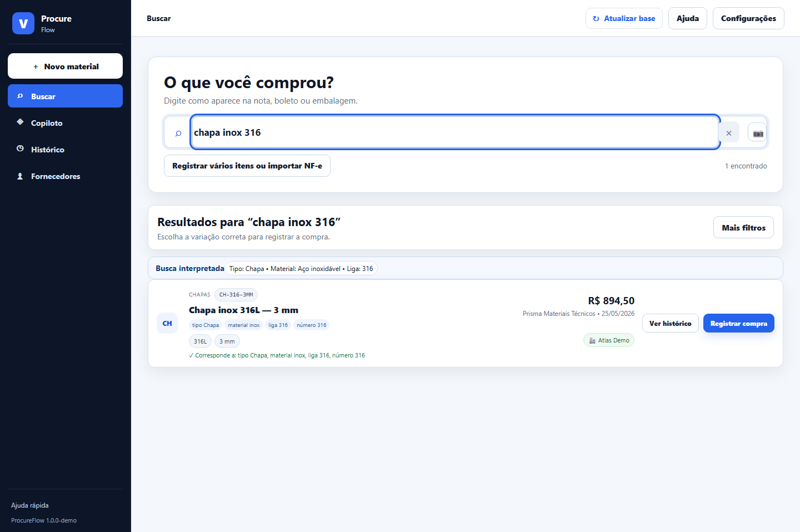
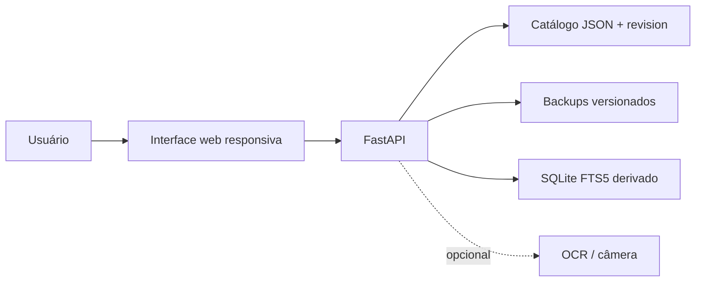
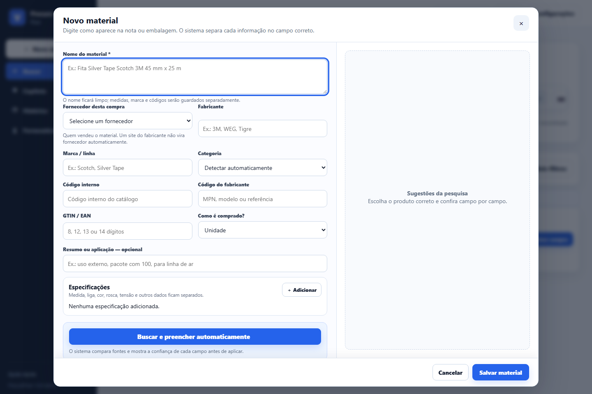
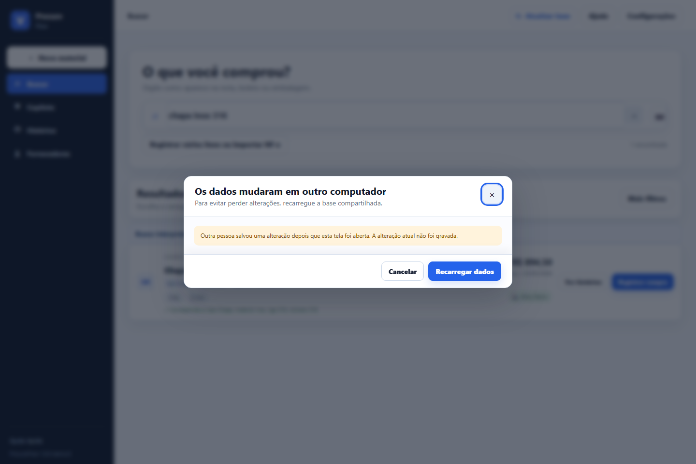

# Catálogo Operacional de Compras

[](https://github.com/Mayconxzdev/CatalogoOperacional/actions/workflows/validate.yml) [](LICENSE) [](CHANGELOG.md)



O **Catálogo Operacional de Compras** é a edição pública e sanitizada de um sistema interno que desenhei e implementei para substituir a consulta diária em uma planilha compartilhada. A versão interna organiza uma base histórica com **24 categorias operacionais e mais de 480 códigos de materiais**, permitindo pesquisar materiais, fornecedores, preços e histórico sem que uma edição antiga sobrescreva silenciosamente o trabalho de outra pessoa.

> Todos os materiais, fornecedores, valores, históricos, caminhos e imagens desta publicação são fictícios ou demonstrativos. Nenhum dado operacional da empresa está neste repositório.

## Leitura rápida para recrutadores

| Dimensão | Evidência disponível |
|---|---|
| **Uso real** | A versão interna é usada diariamente por três usuários operacionais e consultada pela gestão. |
| **Escala da base** | 24 categorias operacionais e mais de 480 códigos de materiais, derivados de uma planilha cultivada por aproximadamente dois anos. |
| **Busca operacional** | Pesquisa por código, nome, descrição técnica, medida, fornecedor, fabricante e termos relacionados. |
| **Integridade** | Controle otimista por `revision`, backup antes de escritas sensíveis e conflito explícito entre edições simultâneas. |
| **Arquitetura** | FastAPI, catálogo JSON versionado, SQLite/FTS5 como índice derivado, JavaScript e OCR opcional. |
| **Qualidade pública** | Dados sintéticos, testes isolados, validação de identidade, sintaxe do frontend e GitHub Actions. |

## Problema resolvido

A planilha original reunia informação útil, mas a consulta exigia saber em qual aba, família ou descrição o material havia sido registrado. Quando mais de uma pessoa precisava consultar ou atualizar preços, também existia risco de sobrescrita e dificuldade para reconstruir o histórico.

O sistema transforma essa rotina em um catálogo pesquisável:

```text
Código, nome, fornecedor ou especificação
                 ↓
         busca unificada e FTS5
                 ↓
 material + histórico + último preço + fornecedor
                 ↓
 cadastro ou revisão com controle de concorrência
                 ↓
        backup + nova versão do catálogo
```

## Capacidades demonstradas

- busca por código interno, nome, fornecedor, fabricante, medida e sinônimos técnicos;
- cadastro guiado que separa descrição, especificações, marca, códigos, unidade e fornecedor;
- histórico de compras e último preço conhecido por item;
- conflito por revisão para impedir sobrescrita silenciosa entre computadores;
- backup automático antes de operações sensíveis e restauração controlada;
- índice SQLite FTS5 reconstruído em segundo plano a partir da fonte versionada;
- importação e exportação de planilhas, leitura de código por câmera e OCR opcional;
- auditoria de preços, itens incompletos e fornecedores semelhantes;
- API FastAPI local e interface entregue pelo próprio servidor, sem SaaS obrigatório.

## Arquitetura



### Decisões que importam

| Decisão | Motivo |
|---|---|
| JSON como fonte de gravação | Mantém uma base legível, exportável e simples de recuperar na escala atual. |
| SQLite/FTS5 como índice derivado | Acelera a pesquisa sem transformar o índice na única fonte de verdade. |
| Controle de `revision` | Uma tela antiga recebe conflito em vez de apagar uma alteração mais recente. |
| Backup antes da escrita | Reduz o risco operacional durante atualizações sensíveis. |
| OCR e câmera opcionais | Ajudam no cadastro, mas a operação principal não depende desses recursos. |
| Token administrativo fora da demo | Escritas em ambiente compartilhado exigem uma barreira explícita adicional. |

Detalhes: [arquitetura](docs/architecture.md) · [segurança](docs/security.md) · [testes](docs/testing.md) · [roteiro de demonstração](docs/demo-walkthrough.md).

## Evidências visuais

| Busca operacional | Cadastro técnico | Conflito de edição |
|---|---|---|
|  |  |  |

As imagens são capturas da aplicação executando a massa de demonstração deste repositório, não ilustrações recriadas.

## Executar a demonstração

Pré-requisitos: Python 3.11+ e PowerShell no Windows.

```powershell
git clone https://github.com/Mayconxzdev/CatalogoOperacional.git
cd CatalogoOperacional
.\scripts\run-demo.ps1
```

Abra `http://127.0.0.1:8090`. O script cria uma cópia local de `demo-data/seed.json` em `.runtime/`, diretório ignorado pelo Git.

## Validar

```powershell
python -m unittest discover -s tests -v
python scripts/validate_public_identity.py
node --check app/renderer/app.js
node --check app/renderer/adapter.js
node --check app/renderer/enhancements.js
```

O GitHub Actions executa os mesmos contratos principais em cada push e pull request.

## Escopo e limites

O Catálogo Operacional de Compras resolve busca, registro e histórico na escala atual. Ele não é apresentado como ERP, módulo fiscal, plataforma de pagamentos ou operação empresarial de grande porte. Uma evolução de escala exigiria banco transacional central, identidade corporativa, autorização por papel, HTTPS, observabilidade e uma política de backup compatível com a organização.

## Histórico de nome

A primeira edição pública foi publicada como **ProcureFlow**. A partir da versão `v1.1.0-demo`, a identidade oficial passou a ser **Catálogo Operacional de Compras**, nome descritivo do problema empresarial atendido. O nome antigo permanece apenas no histórico de versão.

## Autor

Desenvolvido por **Maycon Ferreira** como case de automação de processos, backend, busca operacional e integridade de dados para compras.

## Licença

Código sob licença [MIT](LICENSE). Bibliotecas de terceiros mantêm suas próprias licenças; consulte [THIRD_PARTY_NOTICES.md](THIRD_PARTY_NOTICES.md).
