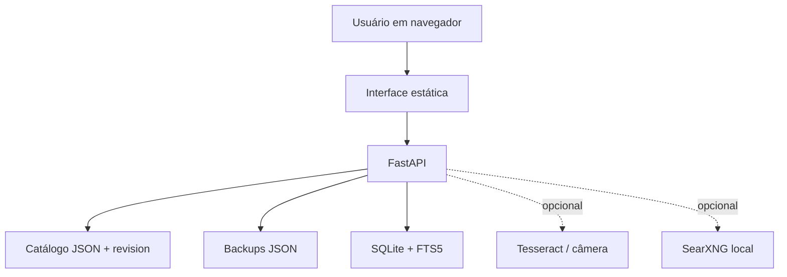

# Arquitetura

## Objetivo de produto

O **Catálogo Operacional de Compras** resolve uma etapa específica do processo: transformar uma base histórica informal em uma fonte compartilhada para busca, registro de preço e consulta de histórico. Ele não tenta reproduzir módulos financeiros, fiscais, de pagamento ou de aprovação de um ERP.

A versão interna é usada diariamente por três usuários operacionais e consultada pela gestão. A edição pública preserva a arquitetura e a experiência com dados totalmente sintéticos.

## Componentes

### Interface

`app/renderer` contém a versão canônica da interface desta demonstração. Ela é entregue pelo FastAPI, evitando duas cópias de frontend com comportamentos diferentes. A linguagem é a de quem compra: busca por código, descrição de nota, medida, nome ou fornecedor, em vez de exigir uma taxonomia perfeita antes de começar.

### Catálogo e concorrência

O JSON é a fonte de gravação na escala atual por ser legível, exportável e fácil de recuperar. Cada escrita informa a revisão que o cliente carregou. Quando outra pessoa já alterou o catálogo, a API devolve conflito e exige recarregamento, evitando sobrescrita silenciosa.

### Índice de busca

O SQLite/FTS5 é um índice derivado reconstruído após gravações. A atualização acontece em segundo plano: a confirmação da escrita não precisa aguardar a reconstrução completa. Como não é a fonte de verdade, o índice pode ser recriado sem perda do catálogo.

### Backup e recuperação

Operações sensíveis geram backup antes da escrita. A estratégia não substitui uma política corporativa de retenção, restore testado e armazenamento externo, mas cria uma barreira concreta contra perda acidental na implantação local atual.

### Recursos auxiliares

OCR, leitura por câmera e pesquisa local são conveniências de cadastro. Eles não são pré-requisitos da operação e não substituem a revisão humana de descrição, preço, código ou fornecedor.

## Limites deliberados

- não há login corporativo ou matriz completa de papéis nesta demonstração;
- não há sincronização por SaaS ou banco remoto;
- o modo de demonstração usa somente `127.0.0.1` e massa sintética;
- a publicação não revela quantidades, preços, fornecedores ou caminhos da instalação real;
- uma evolução de escala exige banco transacional central, identidade corporativa, autorização por papel, HTTPS, observabilidade e backup monitorado.
