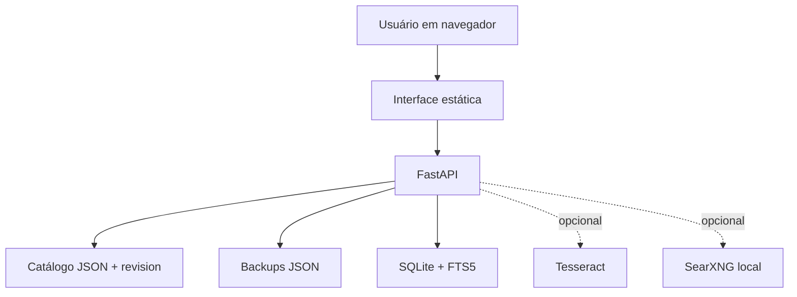

# Arquitetura

## Objetivo de produto

O sistema resolve uma etapa específica do processo de compras: transformar um catálogo informal em uma fonte compartilhada para busca, registro de preço e consulta de histórico. Ele não tenta reproduzir módulos financeiros, fiscais ou de aprovação de um ERP.

## Componentes

### Interface

`app/renderer` contém a única versão canônica da interface desta demonstração. Ela é entregue pelo FastAPI, evitando duas cópias de frontend com comportamentos diferentes. A tela foi projetada para a linguagem de quem compra: busca por descrição de nota, medida, código ou fornecedor, em vez de exigir uma classificação perfeita antes de começar.

### Catálogo e concorrência

O JSON é a fonte de gravação por ser legível, exportável e fácil de recuperar. Cada gravação informa a revisão que o cliente carregou. Se a revisão já mudou, a API devolve um conflito e a interface orienta o usuário a recarregar, em vez de apagar o trabalho de outra pessoa.

### Índice de busca

O SQLite/FTS5 é derivado do catálogo após cada gravação. A reconstrução acontece em thread de fundo: o usuário recebe a confirmação da gravação sem esperar o índice completo. Como o índice é derivado, ele pode ser recriado sem perda do catálogo.

### Recursos auxiliares

OCR, leitura por câmera e pesquisa local são conveniências de cadastro. Eles não são pré-requisitos da operação e não substituem a revisão humana de descrição, preço ou fornecedor.

## Limites deliberados

- Não há login, perfis ou aprovação fiscal nesta demonstração.
- Não há sincronização por banco remoto ou SaaS.
- O modo de demonstração usa somente `127.0.0.1` e massa sintética.
- Uma implantação corporativa precisa de token, HTTPS/TLS quando aplicável, identidade corporativa e estratégia de backup compatível com a política da empresa.
